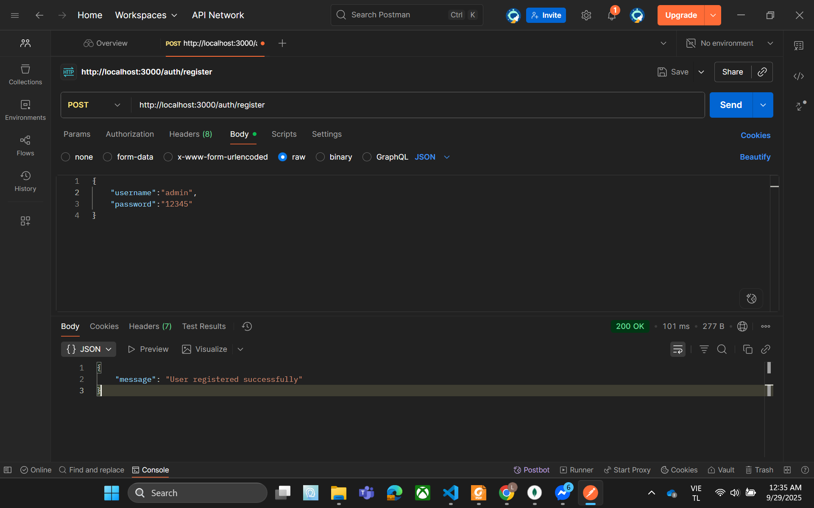
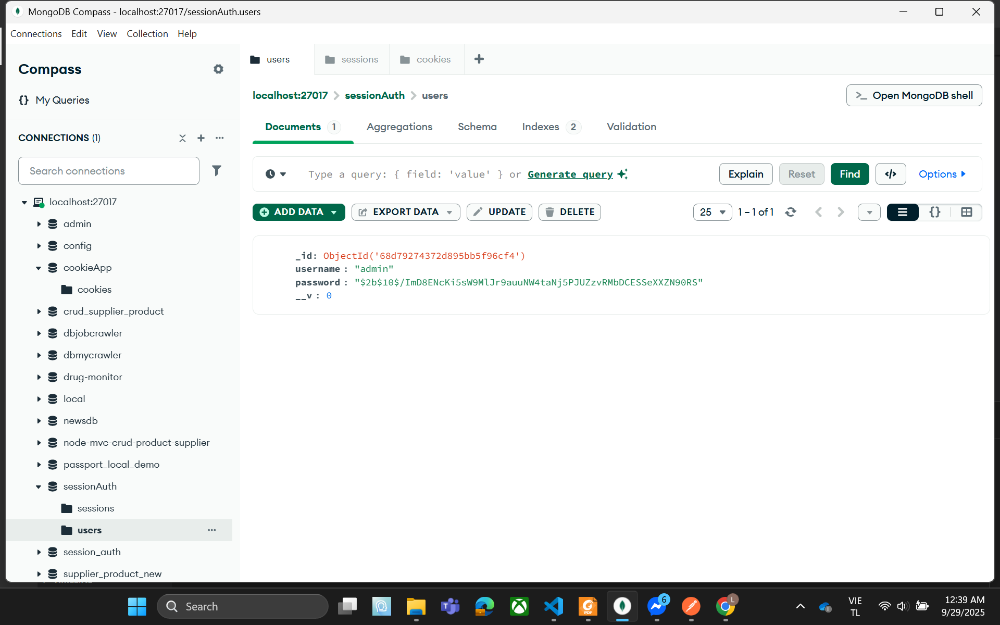
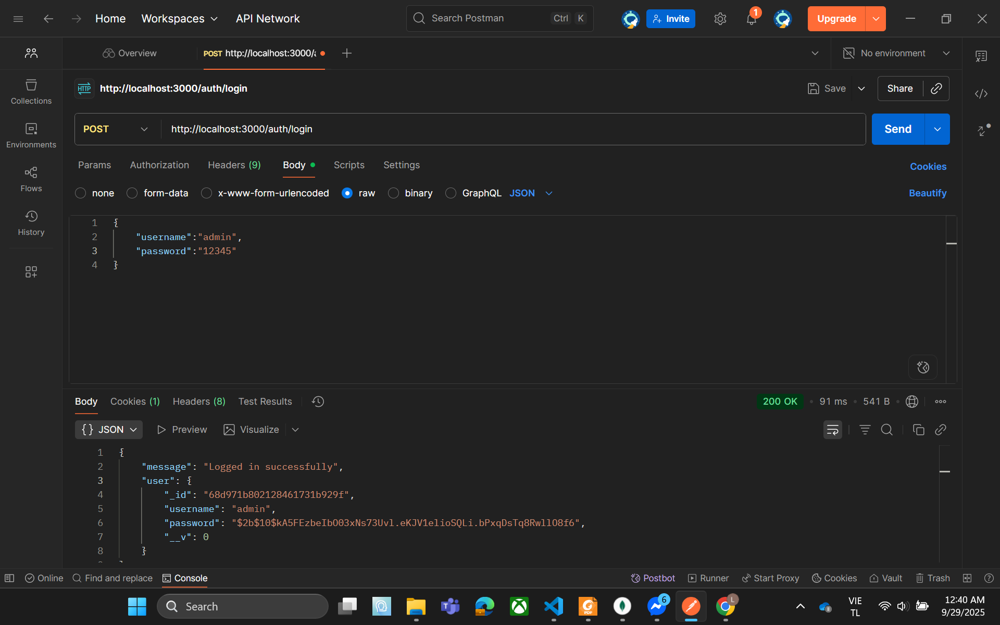
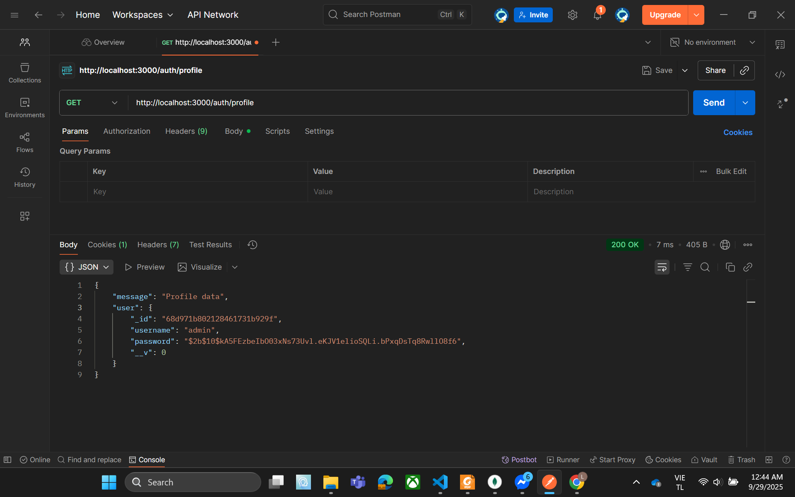
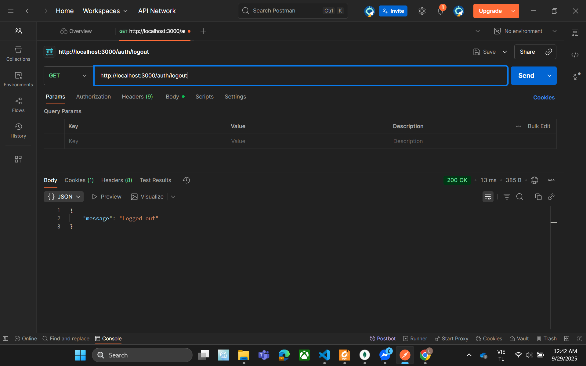
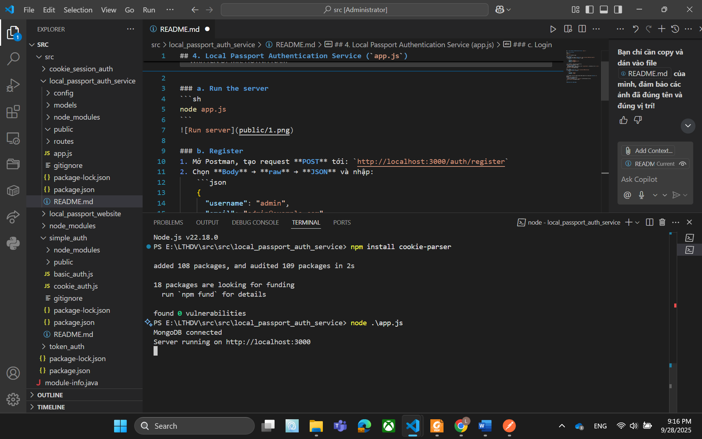

# 3. Local Passport Auth Service (`local_passport_auth_service`)

## Steps to Test

1. **Run server**
   ```bash
   node app.js
Server chạy tại http://localhost:3000.

Register

Endpoint: POST /auth/register

Body:

json
Sao chép mã
{
  "username": "admin",
  "password": "12345"
}
Kết quả: { "message": "User registered successfully" }

Check MongoDB

Database: passport_local_demo

Collection: users

Có thêm user mới đã đăng ký.

Login

Endpoint: POST /auth/login

Body:

json
Sao chép mã
{
  "username": "admin",
  "password": "12345"
}
Kết quả: { "message": "Logged in successfully", "user": {...} }

Đồng thời Postman lưu cookie connect.sid.

Profile (Protected)

Endpoint: GET /auth/profile

Nếu chưa login → { "message": "Not authenticated" }

Nếu đã login → { "message": "Profile data", "user": {...} }

Logout

Endpoint: GET /auth/logout

Kết quả: { "message": "Logged out" }

Profile sau khi Logout

Endpoint: GET /auth/profile

Kết quả: { "message": "Not authenticated" }
## Screenshots

  
  
  
  
  
  
# local_passport_auth_service
